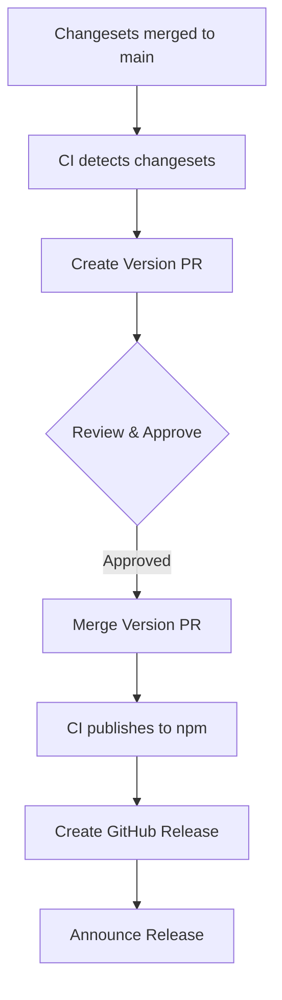

# Release Workflow

> Detailed release workflow for fusionAIze SDK packages

## Overview

This document describes the release workflow for fusionAIze SDK packages, including normal releases, pre-releases, and emergency releases.

## Release Types

### 1. Normal Release (Weekly)

**Trigger**: Automated on Friday, or manual when changesets present
**Process**: Automated via GitHub Actions
**Audience**: All consumers

**Workflow**:


### 2. Pre-Release (Alpha/Beta/RC)

**Trigger**: Manual for testing new features
**Process**: Semi-automated with snapshot releases
**Audience**: Early adopters, internal testing

**Workflow**:
```bash
# Create snapshot release
pnpm changeset version --snapshot beta

# Build and publish
pnpm build
pnpm release --tag beta

# Consumers install with tag
pnpm add @fusionaize/sdk-core@beta
```

### 3. Emergency Release (Hotfix)

**Trigger**: Critical bug or security fix
**Process**: Fast-track with emergency label
**Audience**: All consumers (urgent update)

**Workflow**:
```bash
# Create emergency changeset
pnpm changeset --add --label emergency

# Fast-track review and merge
# CI detects emergency label, skips some checks
# Publish immediately after merge
```

## GitHub Actions Workflows

### Primary Release Workflow (`.github/workflows/release.yml`)

```yaml
name: Release
on:
  push:
    branches: [main]
  workflow_dispatch:  # Manual trigger

jobs:
  release:
    runs-on: ubuntu-latest
    steps:
      - uses: actions/checkout@v4
      - uses: pnpm/action-setup@v4
      - uses: actions/setup-node@v4
        with:
          node-version: 20
          cache: 'pnpm'
      
      - name: Install dependencies
        run: pnpm install --frozen-lockfile
      
      - name: Build packages
        run: pnpm build
      
      - name: Create Release Pull Request or Publish
        uses: changesets/action@v1
        with:
          publish: pnpm release
          version: pnpm changeset version
        env:
          GITHUB_TOKEN: ${{ secrets.GITHUB_TOKEN }}
          NPM_TOKEN: ${{ secrets.NPM_TOKEN }}
```

### Pre-Release Workflow (`.github/workflows/pre-release.yml`)

```yaml
name: Pre-Release
on:
  workflow_dispatch:
    inputs:
      tag:
        description: 'Pre-release tag (alpha, beta, rc)'
        required: true
        default: 'beta'
      snapshot:
        description: 'Use snapshot versioning'
        required: false
        default: false

jobs:
  pre-release:
    runs-on: ubuntu-latest
    steps:
      - uses: actions/checkout@v4
      - uses: pnpm/action-setup@v4
      - uses: actions/setup-node@v4
        with:
          node-version: 20
          cache: 'pnpm'
      
      - name: Install dependencies
        run: pnpm install --frozen-lockfile
      
      - name: Build packages
        run: pnpm build
      
      - name: Create pre-release
        run: |
          if [ "${{ github.event.inputs.snapshot }}" = "true" ]; then
            pnpm changeset version --snapshot ${{ github.event.inputs.tag }}
          else
            pnpm changeset version --pre ${{ github.event.inputs.tag }}
          fi
          pnpm release --tag ${{ github.event.inputs.tag }}
        env:
          NPM_TOKEN: ${{ secrets.NPM_TOKEN }}
```

## Release Pipeline Stages

### Stage 1: Validation

**Checks**:
- [ ] Package boundaries valid
- [ ] Export maps valid
- [ ] TypeScript compiles
- [ ] Tests pass
- [ ] Documentation builds
- [ ] No critical security issues

**Tools**:
- `pnpm check:boundaries`
- `pnpm check:exports`
- `pnpm typecheck`
- `pnpm test`
- `pnpm check:release`

### Stage 2: Versioning

**Process**:
1. Read all changesets in `.changeset/`
2. Calculate new versions based on semver
3. Update `package.json` files
4. Generate/update `CHANGELOG.md` files
5. Delete used changesets

**Commands**:
```bash
# Normal release
pnpm changeset version

# Pre-release
pnpm changeset version --pre beta --tag beta

# Snapshot release
pnpm changeset version --snapshot beta
```

### Stage 3: Publishing

**Process**:
1. Build all packages
2. Publish to npm registry
3. Create GitHub release
4. Update release notes

**Commands**:
```bash
# Build packages
pnpm build

# Publish to npm
pnpm release

# Publish with specific tag
pnpm release --tag beta
```

### Stage 4: Post-Release

**Tasks**:
1. Verify publication (check npm registry)
2. Update documentation if needed
3. Announce release
4. Monitor for issues

## Quality Gates

### Pre-Release Checks

| Check | Tool | Threshold |
|-------|------|-----------|
| Test coverage | Vitest | > 85% |
| Type checking | TypeScript | No errors |
| Linting | Biome | No errors |
| Package boundaries | Custom script | No violations |
| Export maps | Custom script | Valid |

### Release Criteria

**Must Have**:
- ✅ All tests pass
- ✅ TypeScript compiles without errors
- ✅ No breaking changes without major version
- ✅ Documentation updated
- ✅ Changesets present for version bumps

**Should Have**:
- ✅ Performance benchmarks stable
- ✅ Bundle size within limits
- ✅ Dependency updates reviewed

**Nice to Have**:
- ✅ Migration guide for breaking changes
- ✅ Examples updated
- ✅ Release notes drafted

## Release Coordination

### Weekly Release Schedule

| Day | Task | Owner |
|-----|------|-------|
| Mon-Wed | Development, PR review | Package owners |
| Thursday | Release preparation | Release manager |
| Friday AM | Create version PR | Release manager |
| Friday PM | Review & merge | Package owners |
| Friday 3 PM | Publish | CI |
| Friday 4 PM | Announce | Release manager |

### Release Manager Responsibilities

**Before Release**:
- Review pending changesets
- Verify breaking changes have migration guides
- Coordinate with package owners
- Ensure CI passes

**During Release**:
- Create version PR
- Address any issues
- Merge when approved
- Monitor publication

**After Release**:
- Verify publication
- Announce release
- Monitor for issues
- Update release metrics

## Emergency Release Process

### When to Use Emergency Release

1. **Critical security vulnerability**
2. **Major regression affecting many users**
3. **Data loss or corruption bug**
4. **Service outage caused by SDK**

### Emergency Release Steps

1. **Create emergency changeset**:
   ```bash
   pnpm changeset --add --label emergency
   ```

2. **Fast-track review**:
   - Security team + package owner
   - Skip non-critical checks
   - Approve within 4 hours

3. **Emergency publication**:
   ```bash
   pnpm changeset version
   pnpm build
   pnpm release
   ```

4. **Communication**:
   - Security advisory (if security issue)
   - Direct notification to affected users
   - Update documentation

### Emergency Release Checklist

- [ ] Critical issue identified and validated
- [ ] Fix implemented and tested
- [ ] Emergency changeset created
- [ ] Security team notified (if security)
- [ ] Fast-track review completed
- [ ] Published to npm
- [ ] Consumers notified
- [ ] Post-mortem scheduled

## Versioning Strategies

### Independent Versioning

**Pros**:
- Packages evolve at own pace
- Breaking changes isolated
- Consumers update only needed packages

**Cons**:
- More complex dependency management
- Version matrix can be confusing

**Configuration**:
```json
{
  "fixed": [],
  "linked": [],
  "updateInternalDependencies": "patch"
}
```

### Snapshot Releases

**Use Case**: CI testing, early feedback

**Version Format**: `0.0.0-beta.20250115.123456`

**Commands**:
```bash
# Create snapshot
pnpm changeset version --snapshot beta

# Publish snapshot
pnpm release --tag beta
```

### Pre-release Channels

| Channel | Purpose | Stability |
|---------|---------|-----------|
| `alpha` | Early testing | Unstable, breaking changes |
| `beta` | Feature complete | Mostly stable, minor changes |
| `rc` (release candidate) | Final testing | Stable, bug fixes only |

## Monitoring & Metrics

### Release Metrics

| Metric | Target | Measurement |
|--------|--------|-------------|
| Release frequency | Weekly | Time between releases |
| Release success rate | > 95% | Successful releases / total |
| Time to release | < 4 hours | PR creation to publication |
| Rollback rate | < 1% | Releases requiring rollback |

### Quality Metrics

| Metric | Target | Tool |
|--------|--------|------|
| Test coverage | > 85% | Vitest |
| Build time | < 5 minutes | GitHub Actions |
| Bundle size | < 50KB | size-limit |
| Type checking | < 30 seconds | TypeScript |

## Troubleshooting

### Common Issues

**Issue**: Changesets missing for changed packages
**Solution**: Run `pnpm changeset` and add missing changesets

**Issue**: Version PR has conflicts
**Solution**: Resolve conflicts manually, re-run `pnpm changeset version`

**Issue**: npm publish fails
**Solution**: Check NPM_TOKEN, package names, version conflicts

**Issue**: CI fails after release
**Solution**: Check for missing files, build issues, test failures

### Recovery Procedures

**Failed Publication**:
1. Check npm registry for partial publication
2. Clean up any published packages
3. Fix underlying issue
4. Re-run publication

**Wrong Version Published**:
1. Unpublish incorrect version (if possible)
2. Correct version calculation
3. Publish correct version
4. Communicate to consumers

**Breaking Change Accidentally Published**:
1. Unpublish if caught early
2. Publish patch reverting change
3. Communicate issue to consumers
4. Review process to prevent recurrence

## Automation & Tooling

### Changesets Configuration

```json
{
  "$schema": "https://unpkg.com/@changesets/config@3.0.0/schema.json",
  "changelog": "@changesets/cli/changelog",
  "commit": false,
  "fixed": [],
  "linked": [],
  "access": "public",
  "baseBranch": "main",
  "updateInternalDependencies": "patch",
  "ignore": [],
  "snapshot": {
    "useCalculatedVersion": true,
    "prereleaseTemplate": "{tag}.{datetime}"
  }
}
```

### Release Scripts

**Package.json scripts**:
```json
{
  "scripts": {
    "version": "changeset version",
    "release": "changeset publish",
    "release:beta": "changeset publish --tag beta",
    "release:snapshot": "changeset version --snapshot && changeset publish --tag snapshot"
  }
}
```

### CI Configuration

**Required Secrets**:
- `NPM_TOKEN`: npm authentication token
- `GITHUB_TOKEN`: GitHub API token (auto-provided)

**Environment Variables**:
```yaml
env:
  NODE_ENV: production
  CI: true
  NPM_CONFIG_PROVENANCE: true  # For npm provenance
```

## Related Documents

- [Versioning Guide](./README.md) - Overall versioning strategy
- [Stability Labels](./STABILITY_LABELS.md) - API stability annotations
- [Migration Guides](./MIGRATION_GUIDES.md) - Breaking change migration
- [Ownership Model](../governance/OWNERSHIP.md) - Release responsibilities
- [Maintainer Playbook](../governance/MAINTAINER_PLAYBOOK.md) - Maintainer guidance